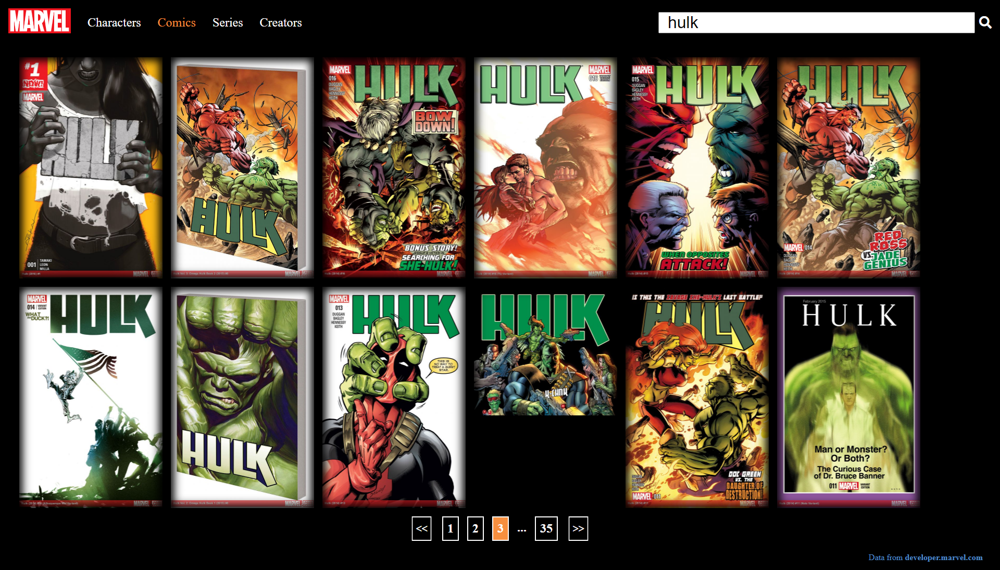

[![LinkedIn][linkedin-shield]][linkedin-url]


<!-- PROJECT LOGO -->
<br />
<p align="center">


  <h1 align="center">Marvel searcher</h1>
  <p align='center'>
    <a href="https://tonijorda.com/myProjects/usingAPIs/marvel/">View Demo</a>
</p>
</p>


<!-- ABOUT THE PROJECT -->
## About The Project
Marvel searcher for comics, series, authors and characters. Each result contains a short description of them, when is available, as well as the related content to the specific search. Also for performing the suggestions I have used a tries data structure. However, it is only implemented for the comics because this part should be implemented in the server because right now the client has to download the entire list of comics and make the using this list.




### Built With

The implementation has been done in JS vanilla, css and html. The data comes from an external API (https://developer.marvel.com/). 


<!-- GETTING STARTED -->
###  Getting Started


1. Clone the repo
   ```sh
   git clone https://github.com/Skebard/marvel.git
   ```
2. Open the index.html in your browser
3. If it does not work, get an API KEY from https://github.com/Skebard/marvel.git
4. insert your API in the file js/script.js you will find the constant API_KEY


<!-- CONTRIBUTING -->
### Contributing

Contributions are what make the open source community such an amazing place to be learn, inspire, and create. Any contributions you make are **greatly appreciated**.

1. Fork the Project
2. Create your Feature Branch (`git checkout -b feature/AmazingFeature`)
3. Commit your Changes (`git commit -m 'Add some AmazingFeature'`)
4. Push to the Branch (`git push origin feature/AmazingFeature`)
5. Open a Pull Request


[linkedin-shield]: https://img.shields.io/badge/-LinkedIn-black.svg?style=for-the-badge&logo=linkedin&colorB=555
[linkedin-url]: http://www.linkedin.com/in/tjorda
